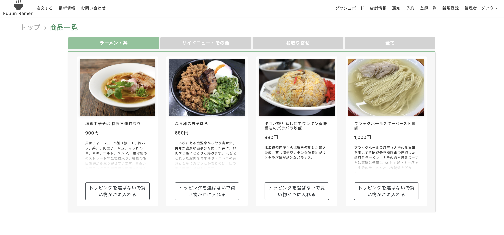
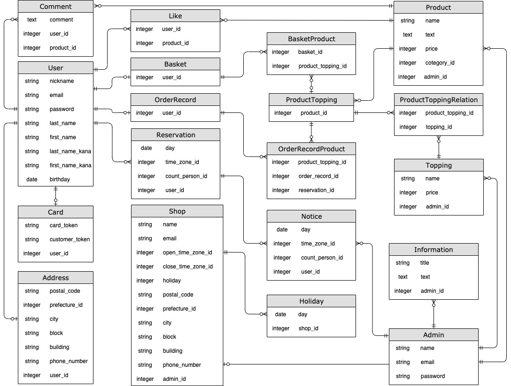

# 概要
架空のラーメン店「Fuuun Ramen」のWebサイトです。
店舗機能とユーザー機能に別れています。

「実店舗が集客・売上をオンラインから得る」

そのファーストステップとしてモバイルオーダーができる飲食店Webサイトを作成しました。

URL: http://fuuun-ramen.com

ユーザー名：admin
パスワード：0429

# 環境・使用技術

### フロントエンド

- HTML, CSS
- JavaScript, Ajax
- Bootstrap4

### バックエンド

- Ruby 2.6.5
- Ruby on Rails 6.0.3.2
- MySQL2

### 開発環境

- Docker/docker-compose
- MySQL2

### 本番環境

- AWS(EC2, S3, Route53)
- MariaDB
- Nginx, Unicorn

### インフラ構成図

- 準備中

### テスト

- Rspec (単体／結合） 計200以上 (準備中)

### その他使用技術

- Active Storage
- Action Mailer
- Rubocop
- Capistrano
- 外部API（PAY.JP）
- レスポンシブ【準備中】
- その他準備中

# ER図

# 機能一覧
- ユーザー機能（お客様）
  - ユーザー情報の登録（住所、クレジットカードなど）
  - 商品の購入（メイン商品とトッピング商品の選択）
  - 予約（来店日時の選択）
  - 選択商品を買い物かご保存
  - お問い合わせ(ログイン不要)
  - パンくずリスト
  - 商品に「食べた!」
  - 購入後の店舗とのチャット【準備中】
  - 商品にコメント投稿【準備中】
  - クーポン機能【準備中】

- 店舗機能（店舗管理者）
  - 店舗情報の登録（定休日、休日の設定）
  - 商品追加、編集(メイン商品、トッピング商品、販売停止)
  - トップページに最新情報の投稿
  - 予約の通知
  - 売上分析【準備中】
  - 購入済お客様とのチャット【準備中】

# 制作背景
前職では長年、店舗運営に関わるビジネスを行って参りました。
管理業務、業務効率の側面ではIT活用は進みつつありましたが、集客・売上を得られるIT活用こそが最重要課題と感じていました。

このアプリケーションでは「飲食店舗がECサイトでの売上軸を確立すること」に取り組みました。
ファーストステップとして、Webサイトへの訪問を日常的に行ってもらう必要があると考えました。

「まずは今現在、店舗に来店してくださるお客様に、Webサイトへのログインをしてもらう」

これが町のラーメン店「Fuuun Ramen」のモバイルオーダーが可能なアプリケーションWebサイトの制作背景です。

# About me
アミューズメント施設を運営する会社に14年間勤めておりました。
エリアマネージャーとして、インターネットカフェ店舗5店舗、カプセルホテル店舗2店舗の運営・企画・新規出店・マネージメント業務を担当しておりました。

ソフトウェア、アプリケーションの開発に興味を持ち、2020年7月からWebエンジニアを目指してプログラミングスクールに通い勉強中です。
